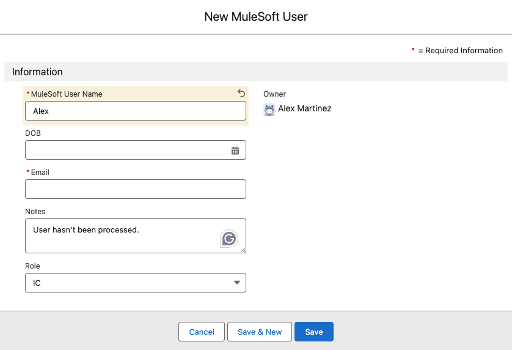

# AsyncAPI with MuleSoft + Salesforce Platform Events

Code demonstrated in the Create AsyncAPIs with MuleSoft and Salesforce Platform Events blog post.

## Similar repos

[](https://github.com/alexandramartinez/asyncapis-accounts-email)
[](https://github.com/alexandramartinez/my-process-api-munits)

## Use case

You have your Salesforce organization up and running. You have a custom object called `MuleSoft User` with a few fields to identify the users.

Now, what you want is to connect to an external system every time there’s a new user and update that external database with this information. The problem is that this external system is available 60% of the time. So, it might take a while before the user finishes processing completely. We can’t just leave a thread open for several minutes or hours until it finishes processing - Salesforce will timeout before that.

The other problem is that the person using the Salesforce org might want to see the progress on this. With no visible access to MuleSoft, they won’t be able to know if it’s already been processed or not. Because of this, we will add a `Notes` field into the object. We can update this field after it’s been processed.



This way, the user is created immediately and the process to send this information to the external system is added to a queue. As soon as the user is processed, we will update this field in the Salesforce object. 

## Salesforce Setup

Let’s start by creating the two Platform Events we will need for this use case: one to process the initial information and a second one to update the object after it’s been processed in the external system.

> [!NOTE]
> We could update the Salesforce object from MuleSoft directly instead of having to go though a second Platform Event. However, for the sake of demonstration, we will be using both events to demonstrate subscription and publication from MuleSoft.

### Platform Events

Let’s call the first one `Process Mule User`. We will add the custom fields we have in the object to make sure we’re sending them all. 


The second one will be called `Update Mule User`. Since we’ll only update the **Notes** field and the **Email** field is a unique identifier, we can simply keep these two fields for this event instead of adding all of them.


Once we are done with the Platform Events configuration, let’s create the actual trigger to connect them to the object. You can do this trigger using Apex, APIs, Flows, and more. For the sake of simplicity, we’ll be using Flows.

### Flows

We will need two flows, one for each action/event. The first one is a `Record-Triggered Flow` that will run every time a new `MuleSoft User` is created. You can see the configuration for this flow in the next screenshot.


Make sure you save and activate the flow before continuing.

The second one is a `Platform Event-Triggered Flow` that will be subscribed to the `Update Mule User` Platform Event. You can see the configuration for this flow in the next screenshot.


Make sure you save and activate the flow before continuing.

That’s it for the Salesforce configuration! Now let’s see how to actually subscribe/publish events using MuleSoft.

## Design and Implement the AsyncAPI

Here comes the fun part. Open Anypoint Code Builder and select **Design an API**. Add any project name and select **AsyncAPI 2.6 (YAML)**. Create the project and paste the following. 

```yaml
asyncapi: '2.6.0'
info:
  title: Salesforce Platform Events Integration
  version: '1.0.0'
  description: Subscribed to receive the Process_Mule_User__e Platform Event and return the Update_Mule_User__e Platform Event after the data is processed.
  contact:
    name: Alex Martinez
    email: alexandra.martinez@salesforce.com
    url: alexmartinez.ca
  license:
    name: test
    url: test
defaultContentType: application/json
tags:
  -
    name: salesforce
    description: makes use of Salesforce Platform Events
servers:
  Salesforce:
    protocol: salesforcepubsub
    protocolVersion: v1
    url: api.pubsub.salesforce.com
channels:
  /event/Process_Mule_User__e:
    publish:
      description: Subscribed to receive the Process_Mule_User__e Platform Event to process it.
      operationId: onUserCreate
      message:
        $ref: "#/components/messages/ProcessMuleUser"
  /event/Update_Mule_User__e:
    subscribe:
      description: Publishes the Update_Mule_User__e Platform Event after the data is processed to be updated in Salesforce.
      operationId: afterUserProcessed
      message:
        $ref: "#/components/messages/UpdateMuleUser"
components:
  messages:
    UpdateMuleUser:
      payload:
        type: array
        items:
          type: object
          properties:
            CreatedById:
              type: string
              examples:
                - 005aj8VZWLAA4
            CreatedDate:
              type: number
              examples: 
                - 1731036421
            Email__c:
              type: string
              examples:
                - fake@email.email
            Notes__c:
              type: string
              examples:
                - User has been processed.
    ProcessMuleUser:
      payload:
        type: object
        properties:
          eventId:
            type: string
            examples:
              - "79613760-7af7-4da1-80f5-1adf02218e4c"
          replayId:
            type: number
            examples:
              - 1234
          event:
            type: object
            properties:
              CreatedDate:
                type: number
                examples:
                  - 1729782090541
              CreatedById:
                type: string
                examples:
                  - "005aj8VZWLAA4"
              MuleSoft_User_Name__c:
                type: string
                examples:
                  - Alex Martinez
              DOB:
                type:
                  - number
                  - "null"
                examples:
                  - null
                  - 1.7306784E+12
              Email__c:
                type: string
                examples:
                  - fake@email.email
              Notes__c:
                type: 
                  - string
                  - "null"
                examples:
                  - null
                  - User hasn't been processed.
              Role__c:
                type: string
                examples:
                  - Ambassador
```

Publish to Exchange using the Command Palette.


After it’s been published, make sure to select **Yes** when ACB asks you if you want to implement the project. Add any project name, folder location, select Mule Runtime 4.8 and Java 17. Once it finishes processing, open the properties file under `src/main/resources` and add your Salesforce credentials as shown below.

```properties
salesforcepubsub.server.Salesforce.reconnection.failsDeployment=true
salesforcepubsub.server.Salesforce.password=your salesforce password
salesforcepubsub.server.Salesforce.username=your salesforce username
salesforcepubsub.server.Salesforce.securityToken=your salesforce token
salesforcepubsub.server.Salesforce.reconnection.reconnect.count=5
api.path=resource\:\:your-org-id\:salesforce-platform-events-integration\:1.0.0\:evented-api\:zip\:salesforce-platform-events-integration.yaml
```

> [!NOTE]
> You don’t need to provide the consumer key/secret but you do need to provide a security token. For more information, see [Reset your Security Token](https://help.salesforce.com/s/articleView?id=xcloud.user_security_token.htm&type=5). If you are using a Trailhead Playground and need to retrieve your username and password, see [Get Your Trailhead Playground Username and Password](https://trailhead.salesforce.com/content/learn/modules/trailhead_playground_management/get-your-trailhead-playground-username-and-password).

After that, open the `flows.xml` file under `src/main/mule` and paste the following. 

```xml
<?xml version="1.0" encoding="UTF-8"?>
<mule xmlns="http://www.mulesoft.org/schema/mule/core" xmlns:apikit-asyncapi="http://www.mulesoft.org/schema/mule/apikit-asyncapi" xmlns:doc="http://www.mulesoft.org/schema/mule/documentation" xmlns:xsi="http://www.w3.org/2001/XMLSchema-instance" xmlns:ee="http://www.mulesoft.org/schema/mule/ee/core" xsi:schemaLocation="http://www.mulesoft.org/schema/mule/core http://www.mulesoft.org/schema/mule/core/current/mule.xsd http://www.mulesoft.org/schema/mule/apikit-asyncapi http://www.mulesoft.org/schema/mule/apikit-asyncapi/current/mule-apikit-asyncapi.xsd http://www.mulesoft.org/schema/mule/salesforce-pub-sub http://www.mulesoft.org/schema/mule/salesforce-pub-sub/current/mule-salesforce-pub-sub.xsd http://www.mulesoft.org/schema/mule/http http://www.mulesoft.org/schema/mule/http/current/mule-http.xsd
	http://www.mulesoft.org/schema/mule/ee/core http://www.mulesoft.org/schema/mule/ee/core/current/mule-ee.xsd">
  <flow name="LISTEN:onUserCreate">
    <apikit-asyncapi:message-listener config-ref="asyncapi-config" channelName="/event/Process_Mule_User__e" doc:name="Process Mule User">
      <apikit-asyncapi:servers>
        <apikit-asyncapi:server value="Salesforce" />
      </apikit-asyncapi:servers>
    </apikit-asyncapi:message-listener>
    <set-variable variableName="MuleUser" value="#[payload]" doc:name="MuleUser" doc:id="zlhhis" />
    <until-successful doc:name="Retry connection" doc:id="rforop">
      <try doc:id="bketaj">
        <logger doc:name="External System" doc:id="dbtgus" />
        <error-handler>
          <on-error-propagate type="CONNECTIVITY" doc:name="Connection error">
            <logger doc:name="Retry" doc:id="trqdbn" />
          </on-error-propagate>
          <on-error-continue type="ANY" doc:name="Any other error">
            <logger doc:name="Do not retry" doc:id="nflqsy" />
          </on-error-continue>
        </error-handler>
      </try>
    </until-successful>
    <ee:transform doc:name="New payload" doc:id="txlkzu">
      <ee:message>
        <ee:set-payload>
          <![CDATA[
output application/json
---
[{
  CreatedById: vars.MuleUser.event.CreatedById,
  CreatedDate: now() as Number,
  Email__c: vars.MuleUser.event."Email__c",
  Notes__c: "User has been processed."
}]
]]>
        </ee:set-payload>
      </ee:message>
    </ee:transform>
    <apikit-asyncapi:publish config-ref="asyncapi-config" channelName="/event/Update_Mule_User__e" serverName="Salesforce" doc:name="Update Mule User" doc:id="ocapkv" />
    <error-handler>
      <on-error-propagate>
        <logger doc:name="Future processing" doc:id="tgnfcr" />
      </on-error-propagate>
    </error-handler>
  </flow>
</mule>
```

Let’s break down this flow in parts to understand it better.

First, we have the Message Listener that is subscribed to the `Process_Mule_User__e` Platform Event. We are saving the content of this payload in the `MuleUser` variable and then the **Until Successful** component starts.


Inside the **Until Successful** block, we create a **Try** block (similar to the Try/Catch strategy in Java). Here’s where we would attempt to connect to the external system and catch any errors that are returned: if we receive a connectivity error, we want to retry the same request; but if we receive a different error (a bad request, for example), we don’t want to retry this. In the latter, we would create a different payload so we can continue with the flow, but we are not resending the error back. Otherwise, the **Until Successful** will attempt to send the bad request again.


If the external system responded before the retries were exhausted, then we continue with the rest of the flow. We create a new payload to be sent into the `Update Mule User` Platform Event and we publish this. The Salesforce Flow will pick up this event and update the appropriate object.


However, if the retries from the **Until Successful** component are exhausted and MuleSoft was not able to reach the external system within this timeframe, we have to put in place yet another strategy to handle this scenario and retry this at a later time. This would happen in the flow’s error handler as shown below.


This future processing can be handled however you see fit, depending on your use case:

1. Re-publish the same payload to the Process Mule User Platform Event one more time so it can be re-processed
2. Make use of a different Message Broker to keep retrying the failed messages (Solace, Anypoint MQ, Kafka, etc.)
3. Publish to a different Platform Event or message broker to change the retry logic (for example, retry once a day only instead of immediately).

It really depends on the availability of the external system and on the resources you have available for your use case to handle this scenario. However, you now have the general knowledge to subscribe to/publish Platform Events!

### Conclusion

This is just one example of how you can best make use of Salesforce and MuleSoft EDA resources. You would think that these types of slow/unreliable external systems are not common, but they are more common than you think! It’s always good to know how to handle these scenarios with different toolkits.

Next step? Creating MUnits for this! That would be a fun challenge. 
