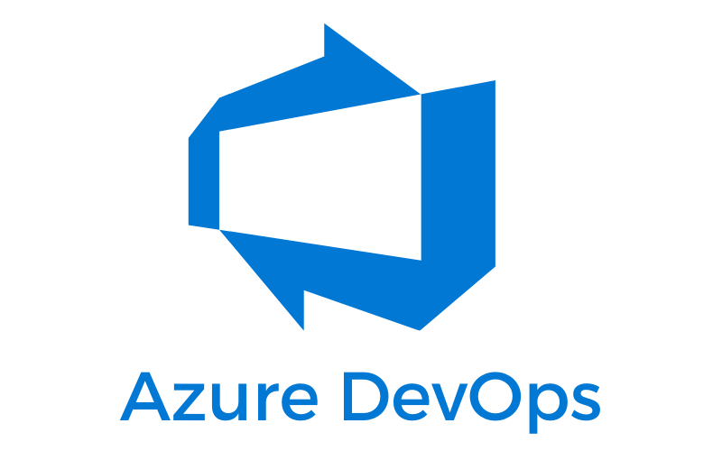
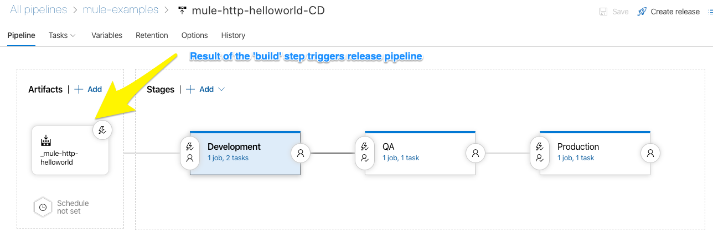
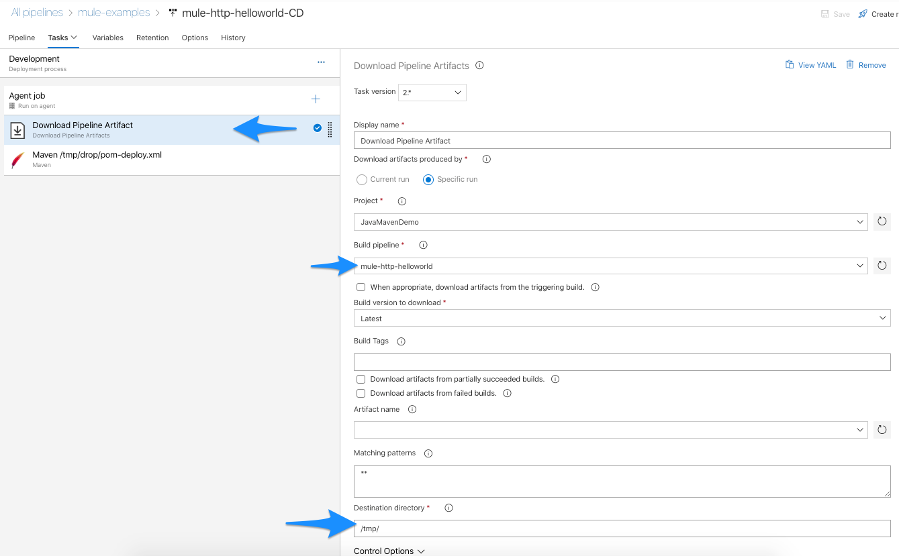
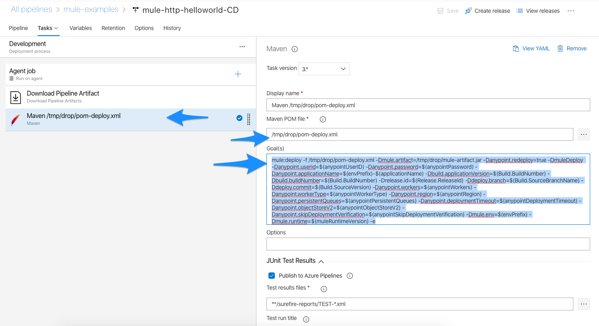

# Azure DevOps Pipeline - CI/CD


 
 ## Azure DevOps Setup
 
 The following section will inform the reader how to setup Azure DevOps to allow for declarative and preconfigured/consistent 
 pipeline.
 
 ### Azure DevOps Variables
 
 Azure DevOps Variables can be setup at the Repository level and/or at the global Bitbucket Variables level.  We would
 imagine that variables like Anypoint UserId/Password, Environment Specific ClientID's etc would be at the global
 Bitbucket Variable level.  
 
 |Property Name                     | Secured? | Description |
  |----------------------------------|----------|-------------|
  |anypointPassword                  | YES      | The password of the user with deployment privileges (configured above) | 
  |anypointUserID                    | YES      | The userid of the user that has deployment privileges (configured above) |
  |applicationName                   | NO       | Application Name to use as Mule App name (we add prefix by env below to generate unique app name) |
  |anypointWorkerType                | NO       | The CloudHub worker type to use for the environment |
  |anypointWorkers                   | NO       | The CloudHub number of workers for the environment |
  |anypointSkipDeploymentVerification| NO       | Wait for CloudHub to provide OK/FAIL (note: increases deploy times quite a bit, as Mule Deployments are not quick) |
  |anypointRegion                    | NO       | The CloudHub deployment region for the environment |
  |anypointPersistentQueues          | NO       | Enable or Disable (true/false) for using Persistent Queues during deployment |
  |anypointObjectStoreV2             | NO       | Enable or Disable (true/false) for using Version 2 of Store during deployment |
  |anypointDeploymentTimeout         | NO       | Time to wait for Deployments to happen before failing |
  |envPrefix                         | NO       | Used to generate unique application name during deployment prefix + applicationName above |
  |muleRuntimeVersion                | NO       | Which mule runtime version to use during deployment |
  |nexusUserID                       | YES      | MuleSoft Nexus Repository user id|
  |nexusPassword                     | YES      | MuleSoft Nexus Repository password|
 
 ## Build - Delclaritive azure-pipelines.yml
 
 
 ## RELEASE PIPELINE
 xxx
 
 
 
 ### Steps
 
 Download Artifacts
 
 
 
 ### Maven Deploy POM
 
 
 
 ```
 mule:deploy -f /tmp/drop/pom-deploy.xml -Dmule.artifact=/tmp/drop/mule-artifact.jar -Danypoint.redeploy=true -DmuleDeploy -Danypoint.userid=$(anypointUserID) -Danypoint.password=$(anypointPassword) -Danypoint.applicationName=$(envPrefix)-$(applicationName) -Dbuild.applicationVersion=$(Build.BuildNumber) -Dbuild.buildNumber=$(Build.BuildNumber) -Drelease.id=$(Release.ReleaseId) -Ddeploy.branch=$(Build.SourceBranchName) -Ddeploy.commit=$(Build.SourceVersion) -Danypoint.workers=$(anypointWorkers) -Danypoint.workerType=$(anypointWorkerType) -Danypoint.region=$(anypointRegion) -Danypoint.persistentQueues=$(anypointPersistentQueues) -Danypoint.deploymentTimeout=$(anypointDeploymentTimeout) -Danypoint.objectStoreV2=$(anypointObjectStoreV2) -Danypoint.skipDeploymentVerification=$(anypointSkipDeploymentVerification) -Dmule.env=$(envPrefix) -Dmule.runtime=$(muleRuntimeVersion) -e
```