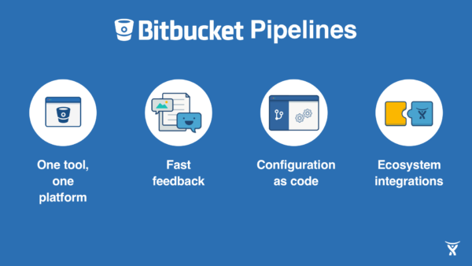
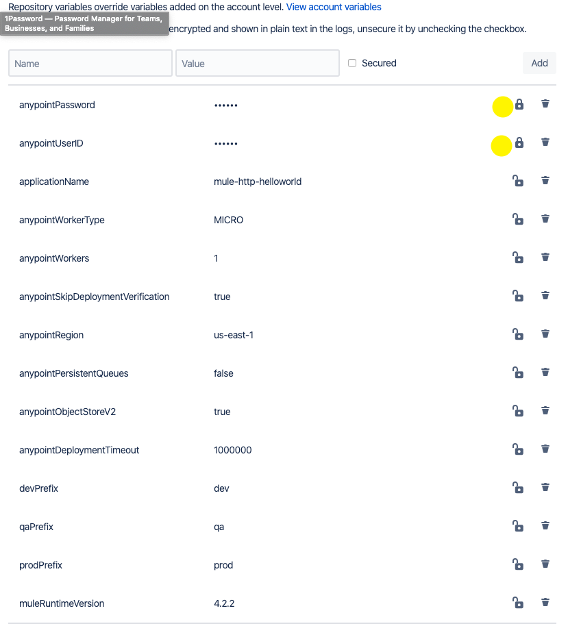

# Bitbucket Pipeline CI/CD

 
## Bitbucket Setup
 
 The following section will inform the reader how to setup Bitbucket to allow for declarative and preconfigured/consistent 
 pipeline.
 
### Bitbucket Variables
 
 Bitbucket Variables can be setup at the Repository level and/or at the global Bitbucket Variables level.  We would
 imagine that variables like Anypoint UserId/Password, Environment Specific ClientID's etc would be at the global
 Bitbucket Variable level.  
 
 In this example we will be setting all variables at the Repository Level.
 
  
 
 |Property Name                     | Secured? | Description |
 |----------------------------------|----------|-------------|
 |anypointPassword                  | YES      | The password of the user with deployment privileges (configured above) | 
 |anypointUserID                    | YES      | The userid of the user that has deployment privileges (configured above) |
 |applicationName                   | NO       | Application Name to use as Mule App name (we add prefix by env below to generate unique app name) |
 |anypointWorkerType                | NO       | The CloudHub worker type to use for the environment |
 |anypointWorkers                   | NO       | The CloudHub number of workers for the environment |
 |anypointSkipDeploymentVerification| NO       | Wait for CloudHub to provide OK/FAIL (note: increases deploy times quite a bit, as Mule Deployments are not quick) |
 |anypointRegion                    | NO       | The CloudHub deployment region for the environment |
 |anypointPersistentQueues          | NO       | Enable or Disable (true/false) for using Persistent Queues during deployment |
 |anypointObjectStoreV2             | NO       | Enable or Disable (true/false) for using Version 2 of Store during deployment |
 |anypointDeploymentTimeout         | NO       | Time to wait for Deployments to happen before failing |
 |devPrefix                         | NO       | Used to generate unique application name during deployment prefix + applicationName above |
 |qaPrefix                          | NO       | Used to generate unique application name during deployment prefix + applicationName above |
 |prodPrefix                        | NO       | Used to generate unique application name during deployment prefix + applicationName above |
 |muleRuntimeVersion                | NO       | Which mule runtime version to use during deployment |
 |nexusUserID                       | YES      | MuleSoft Nexus Repository user id|
 |nexusPassword                     | YES      | MuleSoft Nexus Repository password|
 
 
